.. _karbon:

------
Karbon
------

*The estimated time to complete this lab is 60 minutes.*

.. raw:: html

  <iframe src="https://drive.google.com/file/d/1sU4_1GPVTNGJwNDoy0kB04r-vz4-9Thq/preview" width="720" height="480" frameborder="0" allow="autoplay; encrypted-media" allowfullscreen></iframe>

Overview
++++++++

Nutanix Karbon is an on-prem turnkey curated enterprise-grade Kubernetes service offering that simplifies the provisioning, operations and lifecycle management of Kubernetes.

Karbon provides a consumer-grade experience for delivering Kubernetes on-prem providing huge savings on OpEx of dedicated DevOps or SRE teams to keep Kubernetes online, up to date or integrated with 3rd party components and tooling.

Kubernetes is the container orchestrator that is taking over the world. According to Redmonk, 54 %of Fortune 100 companies are running Kubernetes in some form, with adoption coming from every sector.

What is Kubernetes? 
Kubernetes is an open source container orchestration platform that helps manage distributed, containerized applications at massive scale. You tell Kubernetes that you want your software to run, and the platform takes care of virtually everything else. 

Kubernetes provides a unified API to deploy web applications, batch jobs and databases. Containers—how apps are packaged and deployed in Kubernetes—cleanly decouple applications from their environment. Kubernetes automates the configuration of your applications, manages their lifecycles, and maintains and tracks resource allocation in a cluster of servers. 

Containers and why they drive modern application development
Let’s take a step back from orchestration to talk about containers and why they are so popular. A container provides two key features: a packaging mechanism and a runtime environment. At the runtime level, the container allows an application to run as an isolated process with its own view of the operating system. While VMs provide isolation via virtualized hardware, containers leverage the ability of the Linux kernel to provide isolated namespaces for individual processes. This lightweight nature means each application gets its own container, preventing dependency conflicts. As a packaging mechanism, a container is typically just a tarball: a way to bundle the code, configuration and dependencies of an application into a single file. This eliminates the problem of “It worked on my environment, why doesn’t it work on yours,” because everything necessary to run the application consistently is transported with the container. Ideally, applications produce the same output regardless of environment, and containerization makes that ideal a lot easier to reach. The result is a containerized application that will start, stop, make requests and log the same way. 
For any business, containers represent a large opportunity. 
●  Developers will spend less time debugging environment issues and more time writing code. 

●  Server bills will shrink, because more applications can fit on a server using containers than in traditional deployments. 

●  Containers can run anywhere, increasing the available deployment options. 
For complex applications consisting of multiple components, containers vastly simplify updates. Placing each component in a container makes it simple to make changes without having to worry about unintended interactions with other components. This is the holy grail of decoupling. 
This has led to containers becoming a great way to develop and deploy microservices. Microservices—applications with a single function—naturally benefit from containers, as they provide a clean separation between components and services. 		

For complex applications consisting of multiple components, containers vastly simplify updates. Placing each component in a container makes it simple to make changes without having to worry about unintended interactions with other components. This is the holy grail of decoupling. This has led to containers becoming a great way to develop and deploy microservices. Microservices—applications with a single function—naturally benefit from containers, as they provide a clean separation between components and services.

Container management and orchestration
Containers allow us to ultimately break down an application into discrete functional parts. This has obvious advantages, but also means there are more parts to manage, increasing the workload as your business scales. This introduces complexities for configuration, service discovery, load balancing, resource scaling, and discovering and fixing failures. Managing this complexity is very difficult when attempted manually. Clusters run anywhere from tens, hundreds and even upwards of 1,000 containers; this is why sophisticated automation is necessary. 

Kubernetes delivers production-grade container orchestration, automating container configuration, simplifying scaling, and managing resource allocation. Kubernetes can run anywhere. Whether you want your infrastructure to run on-premise, on a public cloud, or a hybrid configuration of both, Kubernetes delivers at massive scale. 

However, using Kubernetes alone can presents many challenges that make it very difficult for organizations to adopt Kubernetes. When tens or hundreds of users touch a cluster, you need a more robust solution than vanilla Kubernetes. 

An enterprise-ready Kubernetes solution adds additional value on top of Kubernetes, but to make it useable, robust, and maintainable is time intensive. This can extend the time required to deploy a production-ready cluster by months. 

Here are a few reasons why you need Karbon the enterprise-ready Kubernetes distribution. 

●  Engineering dependency 
    o Running Kubernetes requires a significant amount of infrastructure expertise, which can be taxing on small or overloaded infrastructure teams. 
    o Kubernetes is analogous to the Linux kernel meaning it requires gluing together a lot of disparate pieces to deem it enterprise-ready.
    o There is a new version of Kubernetes every quarter and the community deprecates the release after three quarters. 
    o An enterprise-ready Kubernetes solution must include additional components.
      o Container Runtime (we use Moby (formerly Docker))
      o Container-Native Networking (we use Flannel, with Calico support on the roadmap).
      o Container-Native Storage (we use our CSI driver for block (via Nutanix Volumes) and file access (via Nutanix Files).
      o Logging Stack (Elastic, Fluentbit and Kibana).
      o Monitoring and Alerting (Prometeus).
      o Hardened and Secured by default.
●  Excessive risk 
    o Developing your own Kubernetes stack is just as risky to production workloads as using a custom-made distribution of Linux.
●  Increased burden of maintenance 
    o Any engineering organization is going to incur technical debt. 
●  Ballooning costs 
    o Kubernetes expertise commands a premium price on the labor market. 
Very few organizations have in house expertise to run Kubernetes in production, and even those that do have challenges keeping Kubernetes online.
    o Kubernetes is free like a puppy.
●  Catastrophic failure
    o For the enterprise, data loss and downtime are not options.

●  Inconsistent support 
    o Adopting a new technology can be intimidating for large enterprise. 

What are the Use Cases for Kubernetes:
    ●  CI/CD 
    ●  Web Apps
    ●  API and Backend Apps
    ●  Microservices
    ●  Application Modernization
    ●  Cost Containment
    ●  Big Data
    ●  Hybrid Cloud

**In this lab you will deploy a Kubernetes cluster using Karbon and then deploy multiple containers, referred to as Kubernetes pods, to run a sample application.**

Create a Karbon Kubernetes Cluster
++++++++++++++++++++++++++++++++++

In this exercise you will create a production ready Kubernetes cluster with Nutanix Karbon.

In **Prism Central**, select :fa:`bars` **> Services > Karbon**.

.. figure:: images/karbon_create_cluster_0.png

.. note::

  If Karbon has not already been enabled on your cluster, click the **Enable Karbon** button when prompted. Once clicked, the process should take approximately 2 minutes to complete. During this time the cluster is... *<What is it doing?>*

  .. figure:: images/2.png

Click the provided link to launch the **Karbon Console**.

.. note::

  If at any point your Karbon session times out, you can log in again using your Prism Central **admin** credentials.

To begin provisioning a Karbon cluster, click **+ Create Cluster**.

On the **Name and Environment** tab, fill out the following fields:

- **Name** - wordpress-*Initials*
- **Cluster** - Select *Your Nutanix cluster*
- **Kubernetes Version** - 1.10.3
- **Host OS Image** - centos

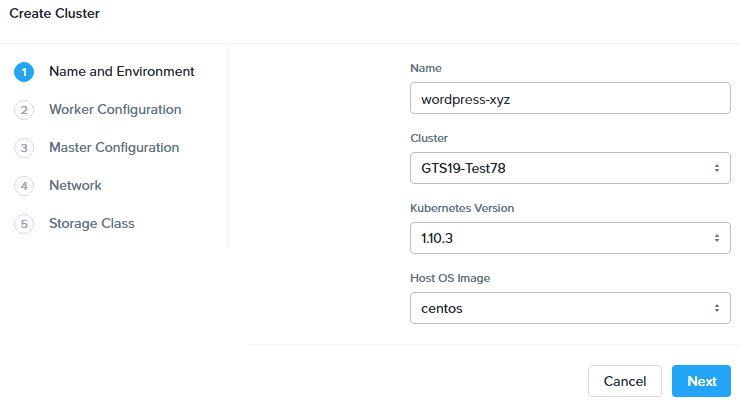

.. note::

  Your cluster has be pre-staged with a compatible CentOS image for use with Karbon.

  Karbon currently supports CentOS 7.5.1804 and Ubuntu 16.04 and requires that these images be downloaded directly from Nutanix.

  To stage another cluster with the supported CentOS image, add http://download.nutanix.com/karbon/0.8/acs-centos7.qcow2 as "acs-centos".

  To stage another cluster with the supported CentOS image, add http://download.nutanix.com/karbon/0.8/acs-ubuntu1604.qcow2 as "acs-ubuntu".

Click **Next**.

Next you will define the number of container host VMs and compute requirements. For the purposes of this exercise you will reduce the amount of memory consumed by default by each worker VM.

On the **Worker Configuration** tab, fill out the following fields:

- **Number of Workers** - 3 (Default)
- **Memory** - 4 GiB
- **Size** - 120 GiB (Default)
- **VCPU** - 4 (Default)

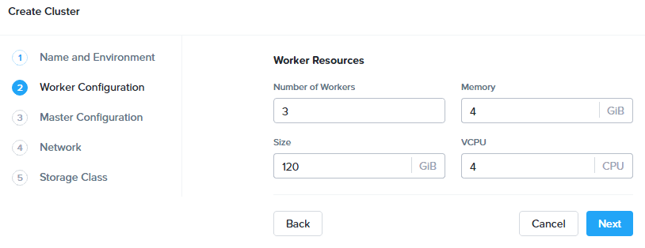

Click **Next**.

Next you will define the compute requirements for the master node which controls the Kubernetes cluster, as well as the number and compute requirements of the etcd nodes, which manage cluster state.

On the **Master Configuration** tab, fill out the following fields:

- **Master Resources > Memory** - 4 GiB (Default)
- **Master Resources > Size** - 120 GiB (Default)
- **Master Resources > VCPU** - 2 (Default)
- **etcd Resources > Number of VMs** - 3 (Default)
- **etcd Resources > Memory** - 4 GiB
- **etcd Resources > Size** - 40GiB (Default)
- **etcd Resources > VCPU** - 2 (Default)

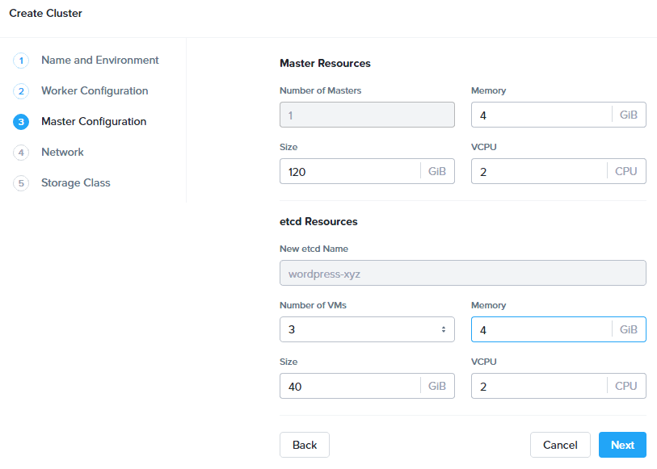

Click **Next**.

Next you will configure the networking for both the host VMs and pods. Karbon utilizes `Flannel <https://github.com/coreos/flannel#flannel>`_ to provide layer 3 IPv4 network between multiple nodes within the Karbon cluster.

Platforms like Kubernetes assume that each pod (container) has a unique, routable IP inside the cluster. The advantage of this model is that it removes the port mapping complexities that come from sharing a single host IP.

The **Service CIDR** defines the network range on which services (like etcd) are exposed. The **Pod CIDR** defines the network range used to IP pods. The default configuration allows for a maximum of 256 nodes with up to 256 pods per node.

On the **Network** tab, fill out the following fields:

- **Network Provider** - Flannel (Default)
- **VM Network** - Primary (Default)
- **Service CIDR** - 172.19.0.0/16 (Default)
- **Pod CIDR** - 172.20.0.0/16 (Default)

.. figure:: images/6.png

Click **Next**.

On the **Storage Class** tab, fill out the following fields:

- **Storage Class Name** - default-storageclass-*xyz*
- **Prism Element Cluster** - *Your Nutanix cluster*
- **Nutanix Cluster Username** - admin
- **Nutanix Cluster Password** - techX2019!
- **Storage Container Name** - Default
- **File System** - ext4 (Default)

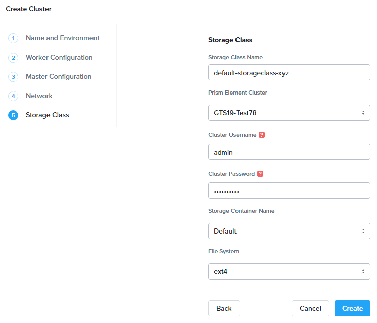

Click **Create**.

Deployment of the cluster should take approximately X minutes. During this time, Karbon is... *<What is it doing?>*

Filtering VMs for **wordpress-**\ *Initials* in **Prism Central** will display the master, etcd, and worker VMs provisioned by Karbon.

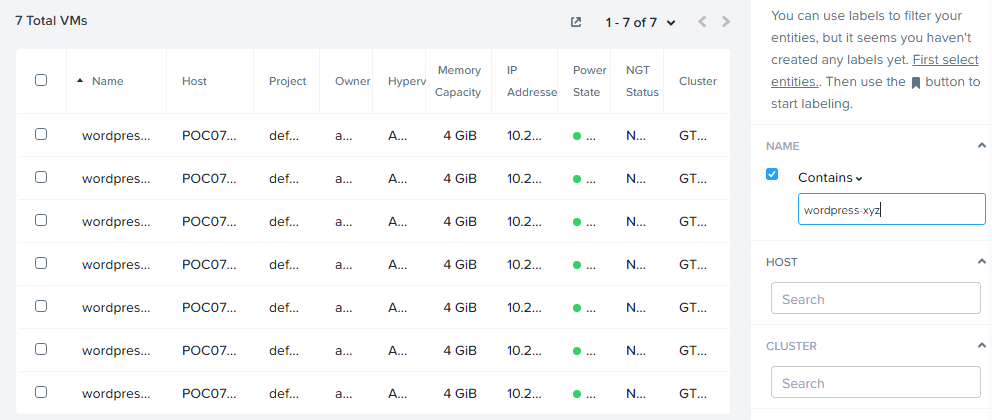

In **Prism Element > Storage > Volume Group**, Karbon has created the **pvc-...** Volume Group, used as persistent storage for logging. Karbon leverages the Nutanix Kubernetes Volume Plug-In to present Nutanix Volumes to Kubernetes pods via iSCSI. This allows containers to take advantage of native Nutanix storage capabilities such as thin provisioning, zero suppression, compression, and more.

.. figure:: images/9.png

The Karbon cluster has finished provisioning when the **Status** of the cluster is **Running**.

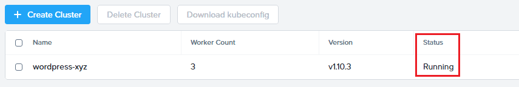

Click on your cluster name (**wordpress-**\ *Initials*) to access the Summary Page for your cluster.

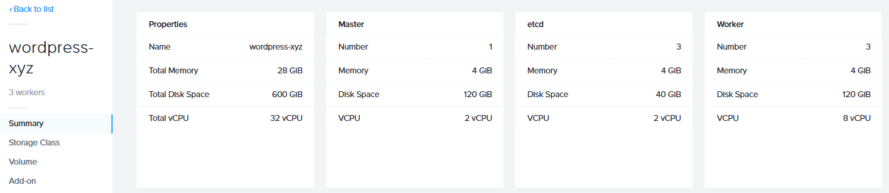

Explore this view and note the ability to create and add additional storage classes and persistent storage volumes to the cluster. Additional persistent storage volumes could be leveraged for use cases such as containerized databases.

Under **Add-on**, note that Kibana has been automatically deployed and configured as part of the Karbon cluster to provide logging services.

In approximately 10 minutes, you have deployed a production-ready Kubernetes cluster with *<X, Y, and Z>* services.

Getting Started with Kubectl
++++++++++++++++++++++++++++

`Kubectl <https://kubernetes.io/docs/reference/kubectl/overview/>`_ is the  command line interface for running commands against Kubernetes clusters. `Kubeconfig <https://kubernetes.io/docs/concepts/configuration/organize-cluster-access-kubeconfig/>`_ files contain information about clusters, users, namespaces, and authentication. The ``kubectl`` tool uses **kubeconfig** files to find and communicate with a Kubernetes cluster.

In this exercise you will use ``kubectl`` to perform basic operations against your newly provisioned Karbon cluster.

Using your **Tools VM**, browse to **Prism Central** and open **Karbon**.

Select your **wordpress-**\ *Initials* cluster and click **Download kubeconfig**.

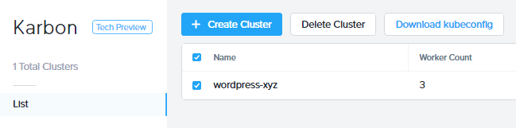

Using your **Tools VM**, open **PowerShell**.

.. note::

  If installed, you can also use a local instance of ``kubectl``. The Tools VM is provided to ensure a consistent experience.

  Instructions for setting up ``kubectl`` in Windows and macOS can be found `here <https://kubernetes.io/docs/tasks/tools/install-kubectl/>`_.

From PowerShell, run the following commands to configure ``kubectl``:

.. code-block:: PowerShell

  cd ~
  mkdir .kube
  cd .kube
  mv ~\Downloads\kubectl* ~\.kube\config
  kubectl get nodes

.. note::

  By default, ``kubectl`` looks like a file named ``config`` in the ``~/.kube`` directory. Other locations can be specified using environment variables or by setting the ``--kubeconfig`` flag.

Verify that the output of the last command shows 1 master node and 3 worker nodes as **Ready**.

Next you will check the versions of the Kubernetes client and server by running the following command:

.. code-block:: PowerShell

	kubectl version

Deploying an Application
++++++++++++++++++++++++

Now that you have successfully run commands against your Kubernetes cluster using ``kubectl``, you are now ready to deploy an application. In this exercise you will be deploying the popular open-source content management system used for websites and blogs, Wordpress.

Using your **Tools VM**, open **PowerShell** and create a **wordpress** directory using the following command:

.. code-block:: PowerShell

	mkdir ~\wordpress
	cd ~\wordpress

Kubernetes depends on YAML files to provision applications and define dependencies. YAML files are a human-readable text-based format for specifying configuration information. This application requires two YAML files to be stored in the **wordpress** directory.

.. note::

  To learn more about Kubernetes application deployment and YAML files, click `here <https://www.mirantis.com/blog/introduction-to-yaml-creating-a-kubernetes-deployment/>`_.

Using your **Tools VM** browser, download the following YAML files for Wordpress and the MySQL deployment used by Wordpress:

- https://kubernetes.io/examples/application/wordpress/mysql-deployment.yaml
- https://kubernetes.io/examples/application/wordpress/wordpress-deployment.yaml

Move both files to the **wordpress** directory using the following command:

.. code-block:: PowerShell

	mv ~\Downloads\*.yaml
	cd ~\wordpress\

Open the **wordpress-deployment.yaml** file with your preferred text editor.

.. note::

  **Sublime Text** has been pre-installed on the **Tools VM**.

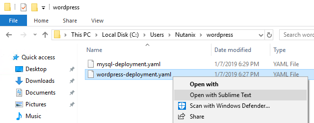

Under **spec: > type:**, change the value from **LoadBalancer** to **NodePort** and save the file. This change is required as Karbon does not yet support LoadBalancer.

.. figure:: images/14.png

.. note::

  You can learn more about Kubernetes publishing service types `here <https://kubernetes.io/docs/concepts/services-networking/service/#publishing-services-service-types>`_.

Next you will need to define a **secret** to be used as the MySQL password. Run the following command to create the secret:

.. code-block:: bash

	kubectl create secret generic mysql-pass --from-literal=password=Nutanix/4u!

Verify the command returns ``secret/mysql-pass created``.

You can also verify the secret has been created by running the following command:

.. code-block:: bash

	kubectl get secrets

Verify **mysql-pass** appears in the **NAME** column.

You will now provision the MySQL database by running the following command:

.. code-block:: bash

	kubectl create -f mysql-deployment.yaml

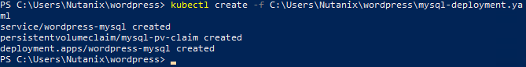

In addition to the MySQL service, the **mysql-deployment.yaml** also specifies that a persistent volume be created as part of the deployment. You can get additional details about the volume by running:

.. code-block:: bash

	kubectl get pvc

You will note that the **STORAGECLASS** matches the **default-storageclass**\ *Initials* provisioned by Karbon.

The volume also appears in **Karbon** under **wordpress-**\ *Initials* **> Volume**.

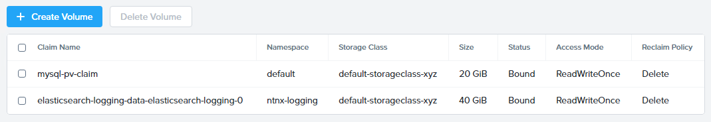

To view all running pods on the cluster, which should currently only be your Wordpress MySQL database, run the following command:

.. code-block:: bash

	kubectl get pods

To complete the application, deploy Wordpress by running the following command:

.. code-block:: bash

	kubectl create -f wordpress-deployment.yaml

Verify both pods are displayed as **Running** using ``kubectl get pods``.

Accessing Wordpress
+++++++++++++++++++

You have confirmed the Wordpress application and its MySQL database are running. Configuration of Wordpress is done via web interface, but to access the web interface you must first determine the IP addresses of our worker VMs and the port on which the pod is running.

The IP addresses of all cluster VMs is returned by the ``kubectl describe nodes`` command. You can run this and search for the **InternalIP** of any of your **worker** VMs, or run the following command to return only the hostnames and IP addresses:

.. code-block:: PowerShell

	kubectl describe nodes | Select-String -Pattern "Hostname:","InternalIP"

.. figure:: images/17.png

To determine the port number of the Wordpress application, run the following command and note the TCP port mapped to port 80:

.. code-block:: bash

	kubectl get services wordpress

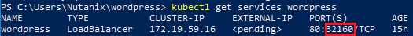

Open \http://*WORKER-VM-IP:WORDPRESS SERVICE PORT*/ in a new browser tab to access to Wordpress installation.

.. note::

  In the example shown, you would browse to http://10.21.78.72:23160. You environment will have a different IP and port.

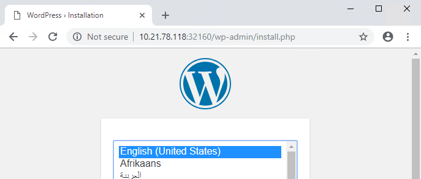

Click **Continue** and fill out the following fields:

- **Site Title** - Karbon Blog
- **Username** - admin
- **Password** - nutanix/4u
- **Your Email** - noreply@nutanix.com

Click **Install Wordpress**.

After setup completes (a few seconds), click **Log In** and provide the credentials just configured.

Congratulations! Your Wordpress application and MySQL database setup is complete.

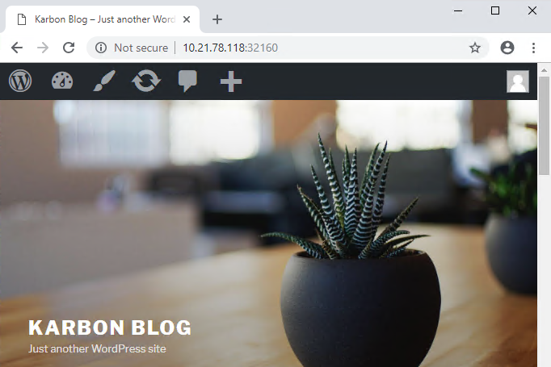

Exploring Logging & Visualization
+++++++++++++++++++++++++++++++++

*<Description of Karbon plug-in architecture>*

Out of the box, Karbon deploys `Elasticsearch <https://github.com/elastic/elasticsearch>`_ and `Kibana <https://github.com/elastic/kibana>`_ to store, search, and visualize logging data for your Kubernetes environment.

*<What's a simple example we can do to illustrate the usefulness of including Kibana?>*

Coming Soon!
++++++++++++

<What are other things people can look forward to in the Karbon GA? Scaling out worker VMs? Anything else? How do these expand use cases or increase value/solve problems?>

Takeaways
+++++++++

What are the key things you should know about **Nutanix Karbon**?

- Karbon is included in all AOS software editions.

- Leveraging Karbon, developers can enjoy the native Kubernetes experience that is delivered fast while all complexities of infrastructure are abstracted with no additional costs.

- Karbon enables enterprises to provide a private-cloud Kubernetes solution with the simplicity and performance of public clouds.

- Karbon is part of a complete Cloud Native solution from Nutanix including storage (Volumes/Buckets/Files), database automation (Era), and enhanced monitoring (Epoch).

Getting Connected
+++++++++++++++++

Have a question about **Nutanix Karbon**? Please reach out to the resources below:

+---------------------------------------------------------------------------------+
|  Karbon Product Contacts                                                        |
+================================+================================================+
|  Slack Channel                 |  #karbon                                       |
+--------------------------------+------------------------------------------------+
|  Product Manager               |  Denis Guyadeen, dguyadeen@nutanix.com         |
+--------------------------------+------------------------------------------------+
|  Product Marketing Manager     |  Maryam Sanglaji, maryam.sanglaji@nutanix.com  |
+--------------------------------+------------------------------------------------+
|  Technical Marketing Engineer  |  Dwayne Lessner, dwayne@nutanix.com            |
+--------------------------------+------------------------------------------------+
